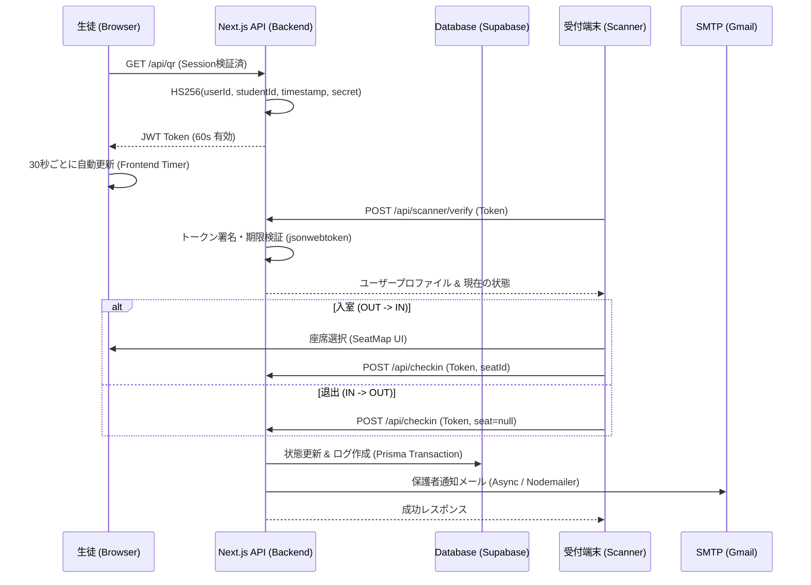
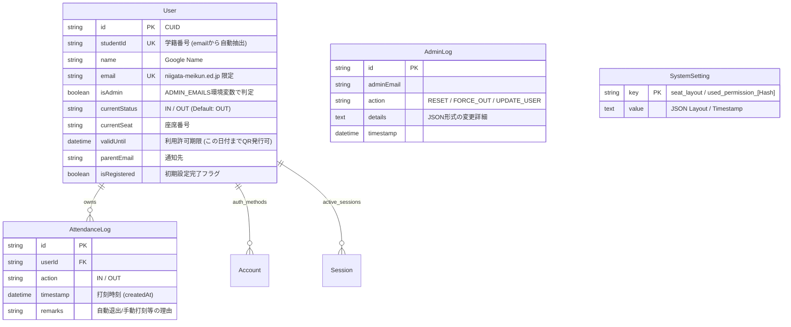

# 🏫 自習室入退室管理システム：テクニカル・マスター・ガイド (詳細仕様書)

本ドキュメントは、システム開発者、技術保守担当者、または次世代の技術リーダーに向けた、**「最大限に詳しい」**技術仕様書です。コードを読む前の全体像把握から、トラブル発生時の内部ロジック特定、拡張開発の指針までを網羅します。

---

## 1. システムアーキテクチャ詳細

本システムは、Next.js 14 の App Router を基盤としたモノリシックなフルスタック構成ですが、フロントエンドとバックエンド（API）が明確に分離されています。

### 技術スタック (Deep Dive)
- **Framework**: Next.js 14.2+ (App Router)
- **Language**: TypeScript 5.0+ (Strict Mode)
- **Database**: PostgreSQL 15+ (Supabase Managed Instance)
- **ORM**: Prisma 5.10+
- **Auth**: NextAuth.js v4 (Google OAuth 2.0 / JWT Session Strategy)
- **Email**: Nodemailer (Gmail SMTP / アプリパスワード認証)
- **Styling**: Tailwind CSS / Headless UI (一部)
- **Container**: Docker (Node.js 18 Alpine) / Docker Compose

### システム・シーケンス図 (データフロー)


---

## 2. データベース物理設計 (Schema Definition)

### Entity-Relationship Diagram (ERD)


---

## 3. 重要ロジックの内部仕様

### 3.1 QRコード (JWT) セキュリティ
- **署名アルゴリズム**: HMAC SHA256 (HS256)
- **署名鍵**: `.env` の `NEXTAUTH_SECRET` を共有キーとして使用。
- **Payload 構成**:
  ```json
  { "userId": "...", "studentId": "...", "timestamp": 1712345678, "purpose": "qr" }
  ```
- **有効期間(TTL)**: 60秒。フロントエンドは30秒ごとに取得し、スキャナー側の時計との僅かなズレを許容。

### 3.2 認証・認可 (NextAuth.js)
- **ドメインフィルタ**: `niigata-meikun.ed.jp` 以外のメールアドレスはログイン段階で `signIn` コールバックにより拒否。
- **セッション拡張**: `session` コールバック内で、データベースを検索し、`isAdmin`, `studentId`, `currentStatus`, `validUntil` をセッションオブジェクトに注入。これによりフロントエンドでの権限チェックを高速化。

### 3.3 レート制限 (Rate Limiting)
- **仕組み**: `lib/rateLimit.ts` にて、IPアドレスまたはユーザーIDをキーとした「試行回数 / ウィンドウ時間」のペアをインメモリ Map で管理。
- **適用対象**: パスコード認証 (`verify-pin`)、メール送信、QR取得等、負荷や不正に繋がるエンドポイント。

### 3.4 保護者申請 (Magic Link)
- **フロー**: 生徒がリクエスト -> JWTトークンをメール送信 -> 保護者がクリック -> トークン検証 -> ユーザーDB更新。
- **再利用防止**: 一度使用されたトークンのハッシュ値を `SystemSetting` テーブルに `used_permission_` 接頭辞付きで保存し、重複使用を防止。

---

## 4. 主要 API リファレンス

| パス | メソッド | Request (JSON) | 動作 |
| :--- | :--- | :--- | :--- |
| `/api/qr` | `GET` | (Header Session) | JWTトークンを1つ発行 |
| `/api/checkin` | `POST` | `{ token, seat }` | トークン検証、ログ作成、状態反転、メール送信 |
| `/api/admin/force-logout` | `POST` | `{ userId }` | 強制的に状態を OUT にし、ログに備考を残す |
| `/api/admin/seat-layout` | `POST` | `{ layout: string[][] }` | 座席レイアウトJSONを更新 |
| `/api/cron/reset-seats` | `GET` | (Auth Header) | 深夜0時に「IN」の全ユーザーを自動「OUT」にする |

---

## 5. インフラ・デプロイ詳細

### Docker 構成
- **Dockerfile**:
    - `node:18-alpine` ベース。
    - `npx prisma generate` をビルド時に実行し、型安全なクライアントを生成。
    - `npm run build` で静的・最適化済みコードを生成し、`npm start` で稼働。
- **docker-compose.yml**:
    - 環境変数を `.env` から一括注入。
    - コンテナの `3000` ポートをホストにマッピング。

---

## 6. 保守担当者向け：トラブルシューティングと運用

### ログの確認
```bash
# Docker コンテナの生ログを表示
sudo docker compose logs -f app
```

### 新年度のリセット手順
1. 管理画面の「システム設定」から「年度リセット」を実行。
2. 全ユーザーの `validUntil` が初期化（または過去日）され、全員「未承認」状態になります。
3. 生徒が再度、新年度の利用申請を保護者に送ることで循環が再開されます。

---

> **将来の拡張へのヒント**
> - **統計機能**: `AttendanceLog` を `action="IN"` と `OUT` でペアリングし、総学習時間を日次/週次で集計可能です。
> - **複数部屋対応**: `SystemSetting` を拡張し、部屋ごとに異なる `seat_layout` を保持できるよう設計の余地を残しています。
